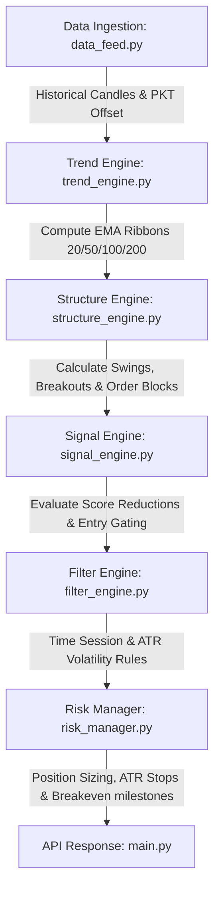

# Auric Sentinel v6: Flow-Based Market Alignment Engine

Auric Sentinel v6 is a premium, high-performance trading intelligence system built on mathematical multi-timeframe trend ribbons, non-repainting market structure tracking, order block mapping, and scoring-based entry gating. It features a FastAPI backend server for calculations and a gorgeous, hardware-accelerated monochrome React frontend dashboard equipped with custom canvas-based meteor backgrounds.

---

## 🛠 Directory Layout

```
├── backend/
│   ├── core/
│   │   ├── data_feed.py          # Yahoo Finance localized data fetcher (PKT offset)
│   │   ├── trend_engine.py       # Multi-timeframe ribbon stacked EMA calculator
│   │   ├── structure_engine.py   # Real-time swings, breakout structure (BOS/CHoCH) & OBs
│   │   ├── signal_engine.py      # Entry gating score matrix & reduction engine
│   │   ├── filter_engine.py      # session filters and ATR volatility filters
│   │   ├── risk_manager.py       # ATR stop loss calculations and trailing breakevens
│   │   └── scanner.py            # Watchlist scanner manager
│   ├── tests/
│   │   └── test_auric_sentinel.py # Pytest test suite with 21 unit tests
│   ├── config.py                 # Pydantic system settings model
│   └── main.py                   # FastAPI app with rate limits and OWASP security headers
├── frontend/
│   ├── src/
│   │   ├── components/
│   │   │   ├── Lightfall.jsx         # Custom canvas meteor light falling background
│   │   │   ├── InteractiveChart.jsx  # TradingView Lightweight Charts v5 overlay
│   │   │   ├── ScannerTable.jsx      # Watchlist scan card grid
│   │   │   ├── ControlPanel.jsx      # Input settings panel
│   │   │   └── ErrorBoundary.jsx     # Safe-wrapper for component crash resilience
│   │   ├── App.jsx                   # React Dashboard coordinator
│   │   ├── index.css                 # Tailwind v4 imports and theme variables
│   │   └── main.jsx                  # React application mount
│   ├── index.html                    # Luxury font imports (Outfit, Syne, Inter)
│   └── vite.config.js                # Vite config using @tailwindcss/vite compiler
├── pine_script/
│   └── auric_sentinel.pine       # Pine Script v6 strategy code matching backend calculations
└── run.bat                       # Dynamic start launcher utility
```

---

## ⚡ Core Architecture & Operational Flow

The backend calculations execute in a synchronous event-driven pipeline on every ticker scan tick:



1. **Ingestion (`data_feed.py`)**: Acquires OHLC candle arrays from Yahoo Finance, resamples time intervals, and normalizes them into Pakistan Standard Time (PKT / UTC+5).
2. **Trend stacked ribbons (`trend_engine.py`)**: Generates 20, 50, 100, and 200 EMA ribbons. Validates trend directionality and calculates EMA compression boundaries.
3. **Structure breaks (`structure_engine.py`)**: Locates swing highs/lows and confirms breaks of structures (BOS) or changes of character (CHoCH) on a zero-repainting basis. Maps order block borders.
4. **Reduction gating (`signal_engine.py`)**: Scores potential entries starting from 6 points, subtracting weights for premium/discount zones, lack of support touches, or ribbon expansions.
5. **Session controls (`filter_engine.py`)**: Validates that triggers fall within London/New York session hours and satisfies ATR volatility boundaries.
6. **Risk framing (`risk_manager.py`)**: Computes stop loss sizes based on swing levels or ATR boundaries, calculates 1:3 reward targets, and locks stop loss to breakeven once price travels 1.5x ATR.

---

## 🔒 Security Hardening Matrix

Auric Sentinel v6 implements a comprehensive defense-in-depth setup to protect against cyber threats:
* **Token-Bucket Rate Limiter**: Limits requests per IP (45 req/min) in [main.py](file:///C:/Users/User/OneDrive/Desktop/New%20folder/backend/main.py) to prevent scanner denial of service.
* **Regex Input Sanitization**: Limits symbol inputs to strict, bounded alphanumeric patterns (`^[A-Za-z0-9=\-\.\^\$]+$`) to prevent shell injection or ticker fuzzing.
* **CSP & Security Headers**: Injects Secure Headers (`X-Frame-Options: DENY`, `X-Content-Type-Options: nosniff`, and restricted `Content-Security-Policy` limits).
* **Pydantic Validation Guard**: Dynamic settings configuration endpoints validate inputs against the schema directly, shielding against Prototype Pollution.
* **React Error Isolation**: Widgets are wrapped in `ErrorBoundary` blocks to prevent browser exceptions from freezing the user screen.

---

## 📈 Running the Test Suite

The python test suite verifies 21 distinct structural scenarios:
```bash
# Run tests from the root directory
.\venv\Scripts\python -m pytest
```
